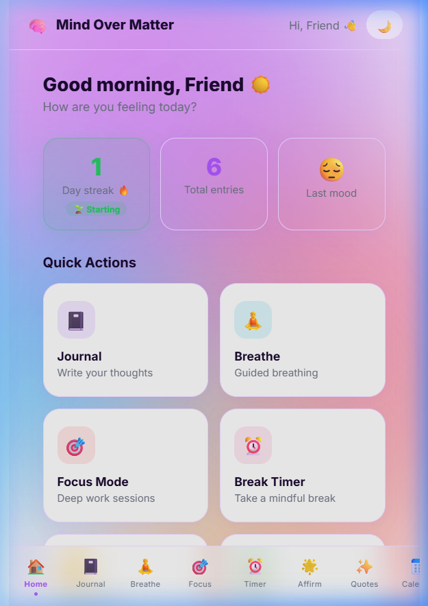
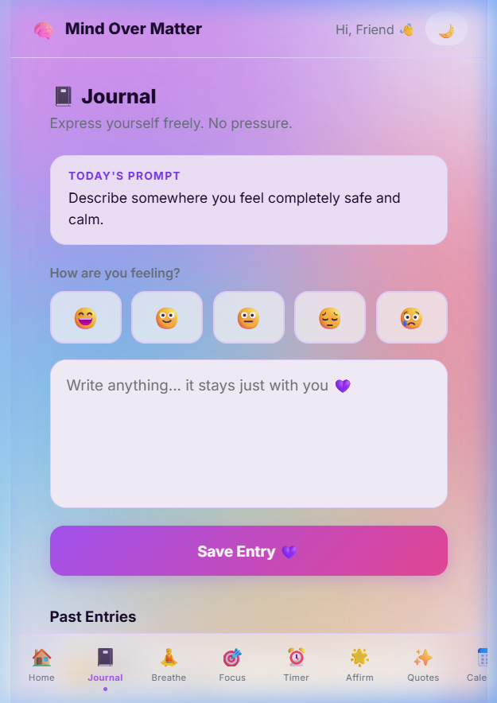
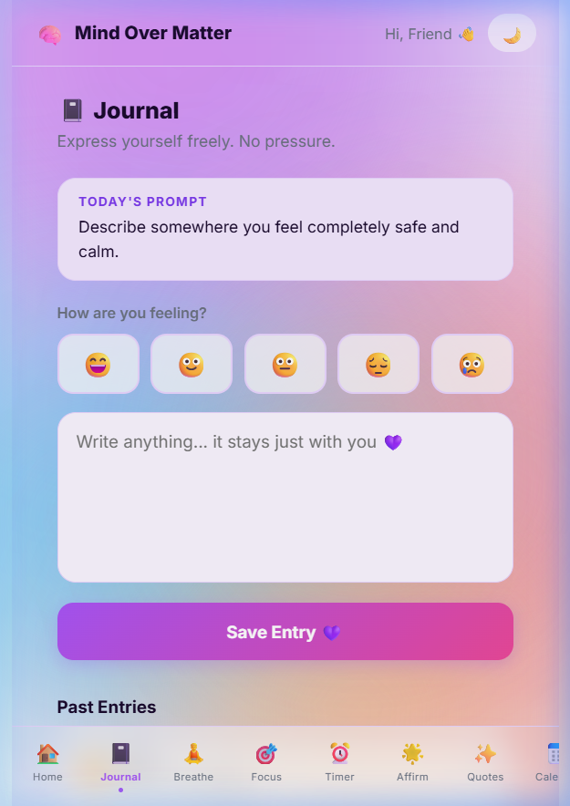
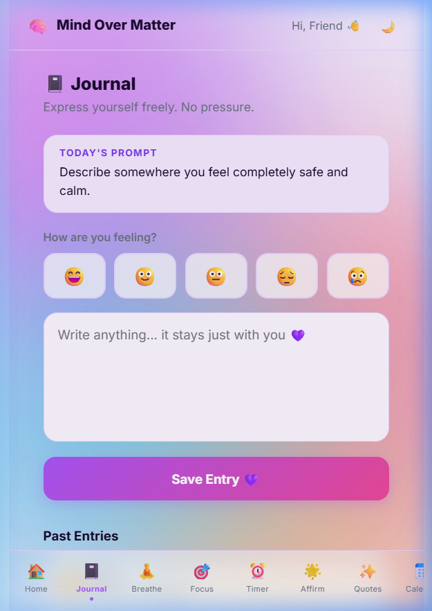
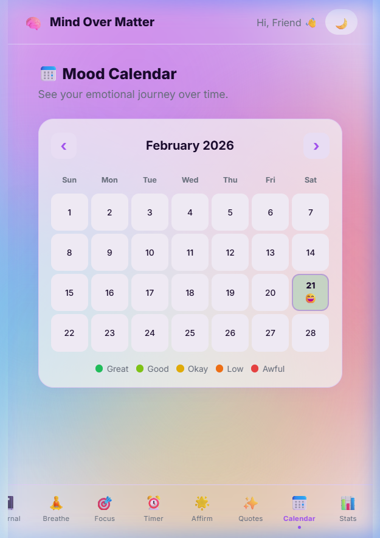
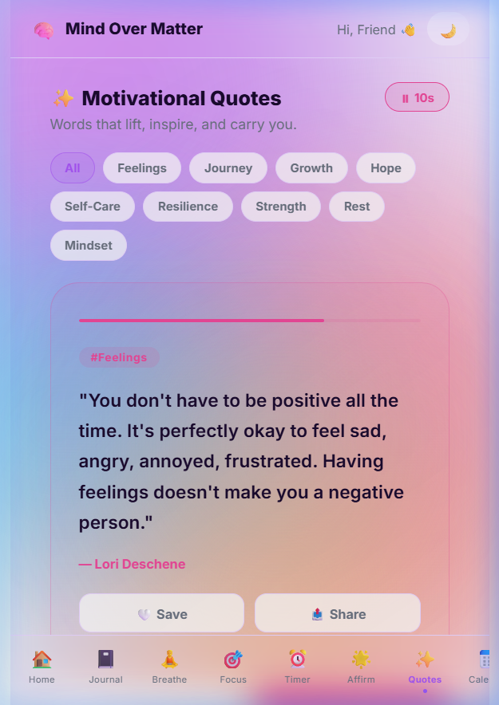

# 🧠 Mind Over Matter

> A beautiful, friendly mental health companion built for Tinkerhack 4.  
> Track your mood, journal your thoughts, breathe with intention, and focus with purpose — all in one place.

[](https://mind-matters-mahi18ma.vercel.app)
[](./LICENSE)
[](https://react.dev)
[](https://vitejs.dev)

---

## 📖 Project Description

**Mind Over Matter** is a mobile-first progressive web app that acts as a personal mental wellness companion. It helps users build healthy daily habits through mood journaling, guided breathing exercises, Pomodoro-based focus sessions, daily affirmations, and motivational quotes.

The app is powered by **Google Gemini AI** for real-time emotional analysis of journal entries, with **Firebase** handling authentication and cloud sync. Everything degrades gracefully to localStorage when offline or unconfigured — so it works for everyone, everywhere.

---

## 🛠️ Tech Stack

| Layer | Technology |
|---|---|
| **Framework** | React 19 (SPA, no router — screen-state navigation) |
| **Build Tool** | Vite 7 |
| **Styling** | Vanilla CSS-in-JS (inline styles + `index.css`) + Inter font |
| **Auth** | Firebase Authentication (Email/Password) |
| **Database** | Firebase Firestore (real-time sync) |
| **AI Analysis** | Google Gemini 1.5 Flash (`@google/generative-ai`) |
| **Fallback NLP** | Custom keyword-based sentiment engine (no API needed) |
| **Deployment** | Vercel |
| **State** | React `useState` / `useEffect` + `localStorage` persistence |

---

## ✨ Features

| # | Feature | Description |
|---|---|---|
| 1 | 📓 **Mood Journal** | Write daily entries with an emoji mood selector (Great / Good / Okay / Low / Awful). Entries sync to Firestore in real-time. |
| 2 | 🤖 **AI Mood Analysis** | Powered by Google Gemini 1.5 Flash — analyses journal text for primary emotion, intensity, positivity %, and returns a personalised support message with suggested activities. Falls back to a keyword engine when no API key is set. |
| 3 | 🧘 **Guided Breathing** | Three breathing patterns: Calm Breath (4-6), 4-7-8 Breath, and Box Breathing (Navy SEAL method). Features an animated pulsing orb + SVG progress ring, with cycle counter. |
| 4 | 🎯 **Focus Mode** | Pomodoro-style timer with four presets: Pomodoro (25/5), Deep Work (50/10), Quick Win (15/3), and a fully custom slider-based mode. Session badges track completed focus blocks. |
| 5 | ⏰ **Break Timer** | Simple guided break countdown to encourage mindful rest between work blocks. |
| 6 | 🌟 **Daily Affirmations** | Auto-rotating positive affirmations with category filter and autoplay toggle. |
| 7 | ✨ **Motivational Quotes** | 18 curated quotes filterable by tag (Hope, Resilience, Growth, etc.), with save-to-collection and native share/clipboard copy. |
| 8 | 📅 **Calendar View** | Full month calendar showing mood emoji per day from journal history. |
| 9 | 📊 **Mood Stats** | Bar/trend graphs showing mood patterns over time using journal entry history. |
| 10 | 🔥 **Streak Tracker** | Tracks consecutive journaling days with milestone badges (Starting → Building → On Fire! → Diamond → Legend). |
| 11 | 💭 **Daily Prompt** | Reflective writing prompts to guide journaling when you don't know where to start. |
| 12 | 🌙 **Dark / Light Mode** | One-click theme toggle, persisted across sessions. |
| 13 | 🔐 **Firebase Auth** | Email/password sign-up and login with real-time auth state persistence. Falls back to guest mode when Firebase is unconfigured. |

---

## 🚀 Installation

### Prerequisites
- Node.js ≥ 18
- npm ≥ 9

### 1. Clone the repository
```bash
git clone https://github.com/Mahi18ma/Mind-Matters.git
cd Mind-Matters
```

### 2. Install dependencies
```bash
npm install
```

### 3. Set up environment variables
```bash
cp .env.example .env
```

Open `.env` and fill in your credentials:

```env
# Firebase (https://console.firebase.google.com)
VITE_FIREBASE_API_KEY=your-api-key
VITE_FIREBASE_AUTH_DOMAIN=your-project.firebaseapp.com
VITE_FIREBASE_PROJECT_ID=your-project-id
VITE_FIREBASE_STORAGE_BUCKET=your-project.appspot.com
VITE_FIREBASE_MESSAGING_SENDER_ID=your-sender-id
VITE_FIREBASE_APP_ID=your-app-id

# Google Gemini AI (https://aistudio.google.com)
VITE_GEMINI_API_KEY=your-gemini-api-key
```

> **Note:** The app works fully without these keys — Firebase features fall back to `localStorage` and AI analysis falls back to the built-in keyword engine.

---

## ▶️ Run Commands

| Command | Description |
|---|---|
| `npm run dev` | Start local development server (http://localhost:5173) |
| `npm run build` | Build production bundle to `dist/` |
| `npm run preview` | Preview the production build locally |

---

## 📸 Screenshots

> _Screenshots from the live deployment_

| Home Dashboard | Journal + AI Analysis |
|---|---|
|  |  |

| Guided Breathing | Focus Mode |
|---|---|
|  |  |

| Mood Calendar | Motivational Quotes |
|---|---|
|  |  |

---

## 🎥 Demo Video

[](https://youtu.be/YOUR_VIDEO_LINK)

> _Walkthrough of all features including AI mood analysis, breathing exercises, and focus timer._

---

## 🏗️ Architecture Diagram

```
┌─────────────────────────────────┐
│           User Browser          │
└────────────────┬────────────────┘
                 │
┌────────────────▼────────────────┐
│   React + Vite Frontend (SPA)   │
│                                 │
│  App.jsx ──► Screen Components  │
│    ├── Onboarding               │
│    ├── Login / Auth             │
│    ├── Home (Dashboard)         │
│    ├── Journal + AIAnalysis     │
│    ├── BreathingScreen          │
│    ├── FocusTimer               │
│    ├── TimerScreen              │
│    ├── AffirmationsScreen       │
│    ├── QuotesScreen             │
│    ├── CalendarView             │
│    ├── GraphScreen              │
│    └── PromptScreen             │
└──┬────────────┬────────┬────────┘
   │            │        │
   ▼            ▼        ▼
┌──────┐  ┌─────────┐  ┌──────────────────┐
│Firebase│  │Firestore│  │ Google Gemini    │
│ Auth  │  │   DB    │  │ 1.5 Flash (AI)   │
└──────┘  └─────────┘  └──────────────────┘
   │            │
   └─────┬──────┘
         │ (offline fallback)
         ▼
   ┌─────────────┐
   │ localStorage │
   └─────────────┘
```

> **Data flow:** User interactions trigger React state updates → components read/write via `utils/db.js` (Firestore or localStorage) and `utils/storage.js` (localStorage). AI analysis runs client-side via the Gemini SDK with a built-in keyword fallback.

---

## 📡 API Docs

This project is a **client-side only SPA** — there is no custom backend. All external API calls are made directly from the browser.

### Google Gemini AI
- **Endpoint:** Managed by `@google/generative-ai` SDK
- **Model:** `gemini-1.5-flash`
- **Used in:** `src/components/AIAnalysis.jsx`
- **Trigger:** Debounced (900ms) on journal text input ≥ 12 characters
- **Request:** POST to Gemini with a structured prompt requesting JSON output
- **Response shape:**
```json
{
  "primaryEmotion": "string",
  "emotions": ["emoji + keyword"],
  "intensity": "Low | Moderate | High",
  "tone": "Uplifting | Positive | Balanced | Heavy | Very Heavy",
  "toneEmoji": "string",
  "color": "#hexcolor",
  "positivityPct": 0-100,
  "support": "string (2-3 sentences)",
  "activities": ["emoji + activity"]
}
```

### Firebase Authentication
- **SDK:** `firebase/auth` v12
- **Method:** `createUserWithEmailAndPassword` / `signInWithEmailAndPassword`
- **Persistence:** `onAuthStateChanged` listener in `App.jsx`

### Firestore
- **Collection path:** `/users/{uid}/entries/{entryId}`
- **Operations:** `addDoc`, `getDocs`, `deleteDoc`, `onSnapshot` (real-time listener)
- **Entry schema:**
```json
{
  "mood": "😄",
  "text": "string",
  "tags": ["string"],
  "createdAt": "Firestore Timestamp"
}
```

---

## 👥 Team Members

| Name | Role | GitHub |
|---|---|---|
| Mahima | Full-Stack Developer & Designer | [@Mahi18ma](https://github.com/Mahi18ma) |

---

## 📄 License

This project is licensed under the **MIT License**.

```
MIT License

Copyright (c) 2026 Mahima

Permission is hereby granted, free of charge, to any person obtaining a copy
of this software and associated documentation files (the "Software"), to deal
in the Software without restriction, including without limitation the rights
to use, copy, modify, merge, publish, distribute, sublicense, and/or sell
copies of the Software, and to permit persons to whom the Software is
furnished to do so, subject to the following conditions:

The above copyright notice and this permission notice shall be included in all
copies or substantial portions of the Software.

THE SOFTWARE IS PROVIDED "AS IS", WITHOUT WARRANTY OF ANY KIND, EXPRESS OR
IMPLIED, INCLUDING BUT NOT LIMITED TO THE WARRANTIES OF MERCHANTABILITY,
FITNESS FOR A PARTICULAR PURPOSE AND NONINFRINGEMENT.
```

---

<div align="center">
  Made with 💜 for Tinkerhack 4 &nbsp;|&nbsp; <strong>Mind Over Matter</strong>
</div>
